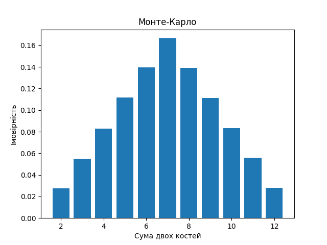

# goit-algo-fp
# Завдання 7.
Програма моделює кидки двох ігрових кубиків за допомогою методу Монте-Карло. Отримані імовірності кожної суми відповідають очікуваним результатам, поданим в аналітичних розрахунках. Розбіжності, які виникають, можуть бути пояснені випадковістю симуляційного методу та обмеженою кількістю ітерацій. Порівняння отриманих результатів підтверджує відповідність методу Монте-Карло теоретичним очікуванням для кидків двох кубиків.

Кількість кидків кубиків = 1000000

### Аналітичні розрахунки
Сума | Імовірність
-----|------------
 2   | 2.78% (1/36)
 3   | 5.56% (2/36)
 4   | 8.33% (3/36)
 5   | 11.11% (4/36)
 6   | 13.89% (5/36)
 7   | 16.67% (6/36)
 8   | 13.89% (5/36)
 9   | 11.11% (4/36)
10   | 8.33% (3/36)
11   | 5.56% (2/36)
12   | 2.78% (1/36)

### Монте-Карло
Сума | Імовірність
-----|------------
 2   | 2.77%
 3   | 5.57%
 4   | 8.34%
 5   | 11.14%
 6   | 13.84%
 7   | 16.66%
 8   | 13.86%
 9   | 11.11%
10   | 8.36%
11   | 5.57%
12   | 2.77%

* Для отримання стабільних та достовірних результатів використано велику кількість симуляцій.
* Точність отриманих результатів залежить від кількості симуляцій, і в даному випадку використано 1000000 симуляцій для досягнення точності.